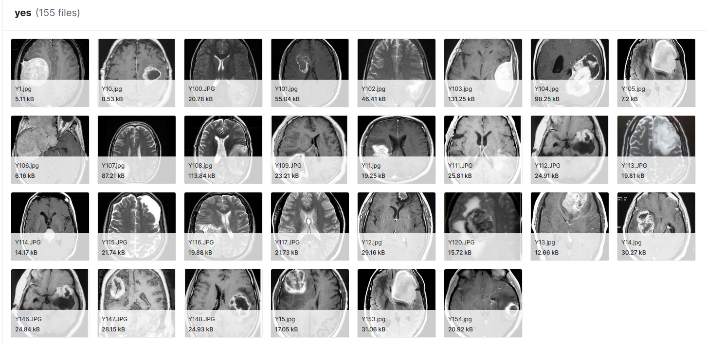

This project and codebase was created for a computational neuroscience workshop for the Biomedical Engineering Society (BMES) at UC San Diego. Here, we go over the basics of image classification in MRI imaging.

## Data Selection 

Data for this project was taken from [Kaggle](https://www.kaggle.com/datasets/navoneel/brain-mri-images-for-brain-tumor-detection). In this set, we are given images comprised of yes and no labels.

## Training and Testing

We preprocess the data by extracting the RGB values of the images after resizing. From here, we perform K-Nearest Neighbors (KNN) over a wide range of neighbors using 5-fold cross-validation. Using this approach, we are able to obtain an accuracy of 77.49% at 73 nearest neighbors.
