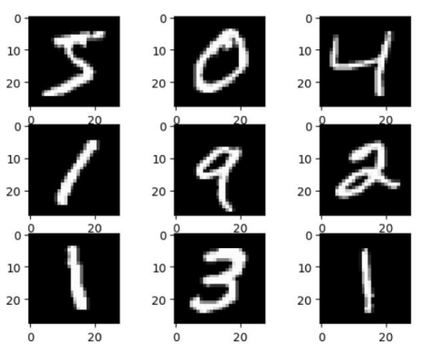

This project and codebase was created for a deep learning workshop for the Institute of Electrical and Electronics Engineers (IEEE) @ UCSD. Here, we go over the basics of image classification using convolutional neural networks (CNN) on the MNIST dataset.

## Data Selection 

Data for this project was taken from [MNIST dataset](https://www.tensorflow.org/datasets/catalog/mnist). In this set, we are given images comprised of handwritten digits from 0 to 9.

## Training and Testing

We format the data by one-hot encoding the labels from 0-9. We then look to normalize our data by dividing the pixel data information by 255. From here, we split our data into train and testing sets, and train a basic CNN model while varying common parameters such as learning rate, batch size, number of epochs, and optimizer. Using this implementation, we are able to obtain an accuracy of 98.77%. 