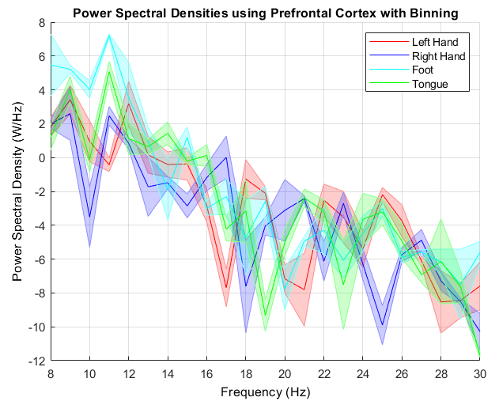
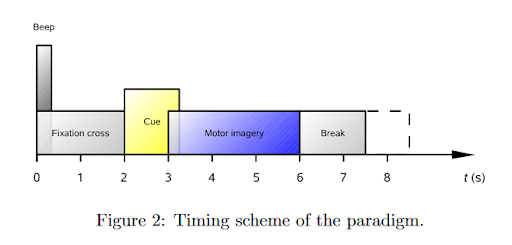

This project and codebase was created for a computational neuroscience workshop for the Institute of Electrical and Electronics Engineers (IEEE) @ UCSD. Here, we go over the basics of supervised learning in electroencephalogram (EEG) data. 

## Data Selection 

Data for this project was taken from the Berlin Brain-Computer Interface (BCI) Competition IV [dataset](https://www.bbci.de/competition/iv/#dataset2a) 2a. In this, we have subjects performing motor imagery tasks. Motor imagery is a cognitive process in where a subject imagines performing a movement without moving their body. In this experimental setup, subjects were asked to imagine four movements: moving the left hand, right hand, tongue, and foot. 

## Feature Selection

We perform feature selection by analyzing the EEG data usinga biological lens. We extract EEG data from the somatosensory cortex within the beta frequency band (8-30 Hz). We're able to extract these features in the frequency domain by transforming our data to the power spectral density (PSD). For demonstration purposes, we look to perform binary classification on the left hand and foot.  

## Training and Testing 

From here, we perform common spatial patterns (CSP), followed by linear discriminant analysis (LDA). Using this method, we obtain an accuracy of 76.55%.

## Future Work

For a more thorough analysis of the feasibility of multi-class EEG classification, you can refer to my motor imagery project developing a novel feature selection and classification pipeline. 