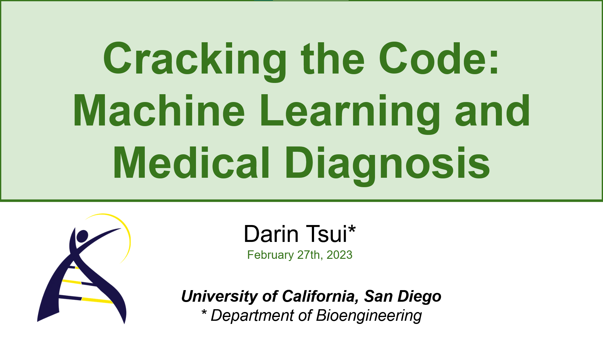
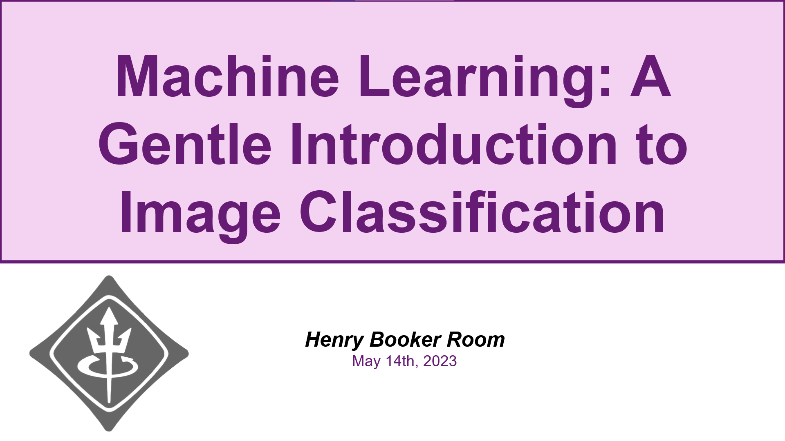
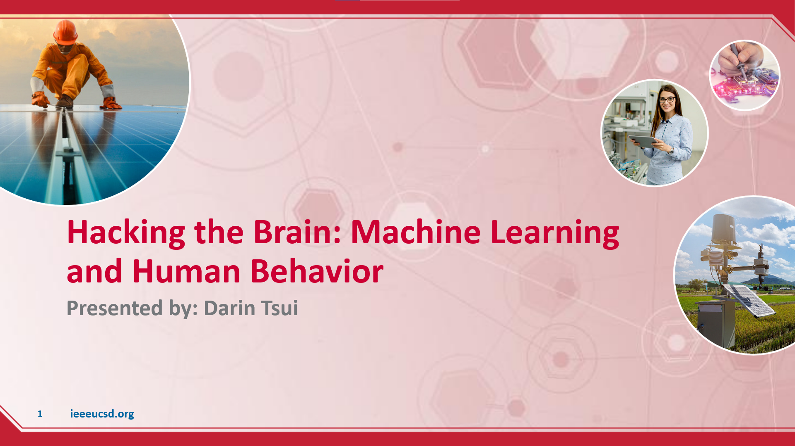

# Workshop and Material Library

This repository contains the various workshops and demos I've given at UC San Diego.

## Description of Workshops

1. **Cracking the Code: Machine Learning and Medical Diagnosis** 

    - Biomedical Engineering Society (BMES) @ UCSD - February 27, 2023

Discusses a simple implementation of K-Nearest Neighbors in MRI image classification, as well as provides a high-level overview of the landscape of machine learning research in medical devices. 

2. **Machine Learning: A Gentle Introduction to Image Classification** 
    - Institute of Electrical and Electronics Engineers (IEEE) @ UCSD - May 14, 2023

Implements a simple CNN model for image classification of the MNISt dataset.

3. **Hacking the Brain: Machine Learning and Human Behavior** 
    - Institute of Electrical and Electronics Engineers (IEEE) @ UCSD - February 6, 2023

Provides an overview of the commputational neuroscience field, and applies signal processing and physiological-based approaches to motor imagery classification. 